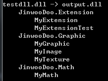

Renamer.Net
====

.Net assembly namespace renamer

Commandline Options
----
* __-s / --src__<br>
    변경할 파일들의 목록
* __-d / --dst__<br>
  저장할 경로의 목록
* __-f / --from__<br>
  검색할 네임스페이스 이름
* __-t / __to__<br>
  변경할 네임스페이스 이름
* -r / --recursive<br>
  해당 어셈블리의 참조까지 모두 변경합니다. (not implemented yet)
* -g / --regex<br>
  `from` 옵션의 값이 정규식임을 지정합니다. 이 플래그를 지정하지 않으면 `StartWith` 메소드를 사용합니다.

(bold -> mandatory option)

Example
----
```
renamer -s testdll.dll -d output.dll -f JinwooDoo -t MyDll
```
<br>


Download
----
[GithubReleasePage](https://github.com/pjc0247/Renamer.Net/releases/tag/0.1.0)
